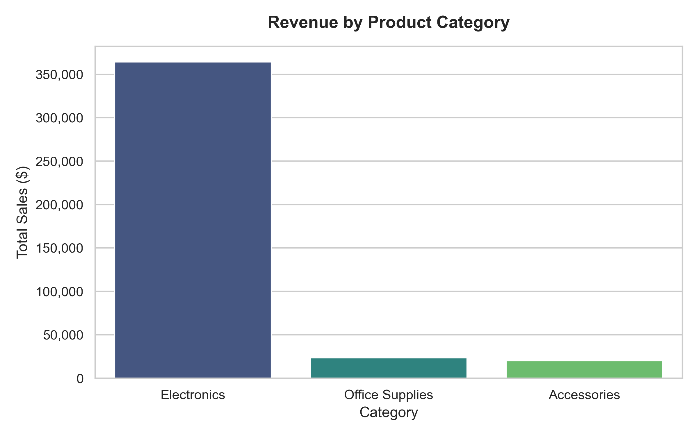
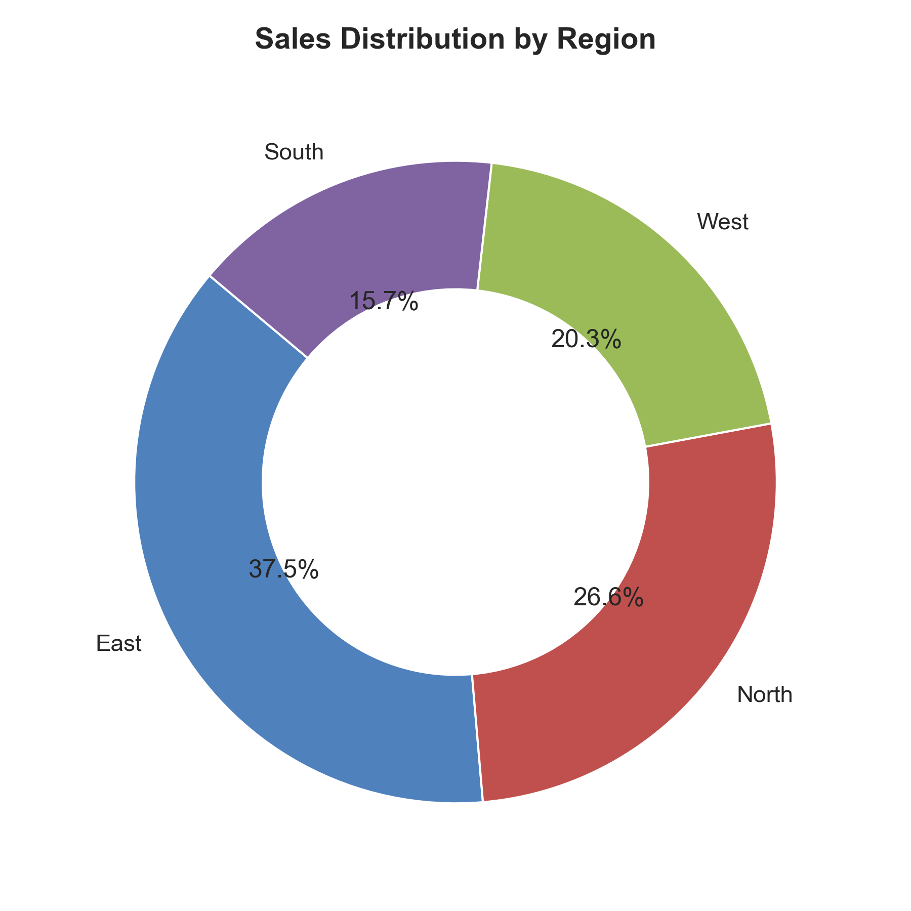
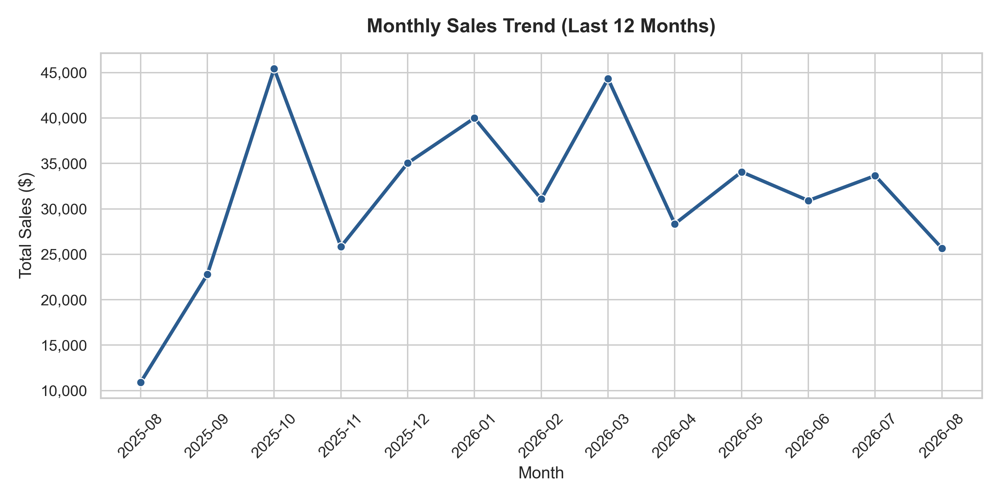
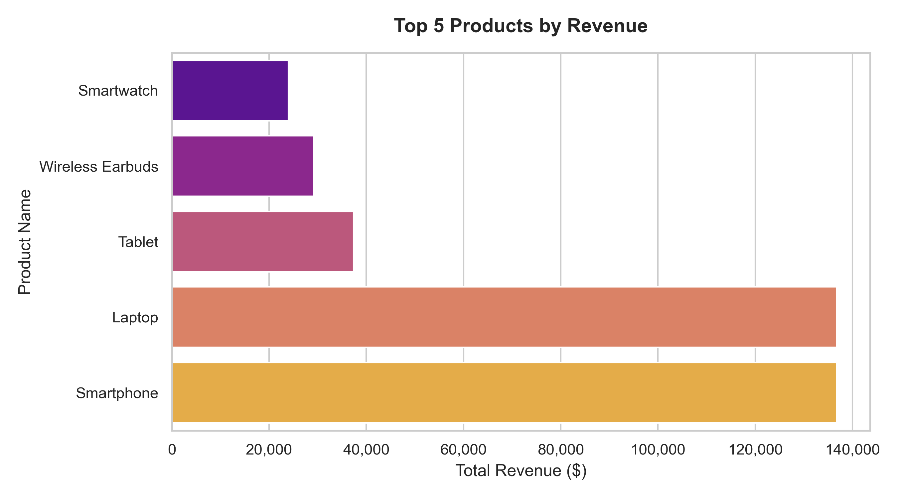

 
**Generated on:** 2026-08-26 09:19:25

---

 

Here is a summary of the high-level performance indicators for the retail sales dataset.

| Metric | Value | Description |
| :--- | :--- | :--- |
| **Total Revenue** | $408,020.00 | Total sales generated across all transactions |
| **Total Orders** | 996 | Number of unique transactions processed |
| **Total Units Sold** | 1,613 | Cumulative quantity of products sold |
| **Average Order Value (AOV)** | $409.66 | Average revenue generated per unique transaction |
| **Total Unique Customers** | 150 | Distinct number of purchasing customers |
| **Average Unit Price** | $263.78 | Average unit price of items sold |

Our product catalog is divided into three key categories. The breakdown of revenue, sales volume, and average price points is detailed below.

| Category | Total Sales | Sales % | Units Sold | Avg Unit Price | Order Count |
| :--- | :--- | :--- | :--- | :--- | :--- |
| **Electronics** | $364,200.00 | 89.3% | 659.0 | $571.81 | 415.0 |
| **Office Supplies** | $23,600.00 | 5.8% | 292.0 | $80.19 | 175.0 |
| **Accessories** | $20,220.00 | 5.0% | 662.0 | $30.35 | 410.0 |

 

*Insight:* **Electronics** is the dominant category, driving the majority of revenue due to higher unit prices. **Accessories** leads in terms of transaction count and volume but contributes less to overall revenue.

---
 

Sales performance across the four major geographic regions highlights where demand is strongest.

| Region | Total Sales | Sales % | Units Sold | Unique Orders | Avg Order Value (AOV) |
| :--- | :--- | :--- | :--- | :--- | :--- |
| **East** | $152,893.00 | 37.5% | 552.0 | 349.0 | $438.09 |
| **North** | $108,384.00 | 26.6% | 468.0 | 287.0 | $377.64 |
| **West** | $82,735.00 | 20.3% | 331.0 | 193.0 | $428.68 |
| **South** | $64,008.00 | 15.7% | 262.0 | 167.0 | $383.28 |

 

*Insight:* The **North** region is the top-performing territory, representing over one-third of the total sales, followed by the **East**. The **South** and **West** regions represent smaller, secondary markets.

---

 

The line chart below tracks sales performance over the last 12 months, detailing monthly totals and Month-on-Month (MoM) growth rates.

| Month | Total Sales | Units Sold | Orders | MoM Growth |
| :--- | :--- | :--- | :--- | :--- |
| 2025-08 | $10,888.00 | 39.0 | 23.0 | N/A |
| 2025-09 | $22,775.00 | 113.0 | 71.0 | 109.2% |
| 2025-10 | $45,435.00 | 154.0 | 91.0 | 99.5% |
| 2025-11 | $25,839.00 | 97.0 | 63.0 | -43.1% |
| 2025-12 | $35,041.00 | 148.0 | 95.0 | 35.6% |
| 2026-01 | $39,997.00 | 153.0 | 89.0 | 14.1% |
| 2026-02 | $31,070.00 | 136.0 | 81.0 | -22.3% |
| 2026-03 | $44,324.00 | 128.0 | 82.0 | 42.7% |
| 2026-04 | $28,346.00 | 139.0 | 90.0 | -36.0% |
| 2026-05 | $34,070.00 | 141.0 | 87.0 | 20.2% |
| 2026-06 | $30,912.00 | 134.0 | 74.0 | -9.3% |
| 2026-07 | $33,654.00 | 122.0 | 80.0 | 8.9% |
| 2026-08 | $25,669.00 | 109.0 | 70.0 | -23.7% |
 

*Insight:* Sales exhibit normal month-to-month fluctuations. A closer analysis of the trend shows peak months that align with customer buying seasons.

---

 

These are the top 5 revenue-generating products in the store.

| Rank | Product | Category | Units Sold | Revenue |
| :--- | :--- | :--- | :--- | :--- |
| 1 | **Laptop** | Electronics | 114 | $136,800.00 |
| 2 | **Smartphone** | Electronics | 171 | $136,800.00 |
| 3 | **Tablet** | Electronics | 83 | $37,350.00 |
| 4 | **Wireless Earbuds** | Electronics | 195 | $29,250.00 |
| 5 | **Smartwatch** | Electronics | 96 | $24,000.00 |

 

*Insight:* The **Laptop** and **Smartphone** products are major revenue drivers, securing the top spots by a wide margin due to their premium unit prices.

1. **Leverage Electronics Success:** Since *Laptops* and *Smartphones* generate the vast majority of revenue, design premium product bundles combining them with high-margin *Accessories* (e.g., Laptops bundled with Laptop Stands or USB-C Cables) to increase AOV.
2. **Double Down on the North Region:** The North is the most lucrative market. Targeted marketing campaigns or regional warehouse expansions in the North could optimize delivery times and enhance customer experience further.
3. **Boost Underperforming Regions:** Analyze customer preferences in the South and West. Introducing localized promotions or partnership deals could capture additional market share in these areas.
4. **Targeted Email Marketing:** With an average order value of ~$409.66, create personalized email campaigns recommending Accessories or Office Supplies to customers who recently purchased high-value Electronics, driving repeat purchase behavior.
